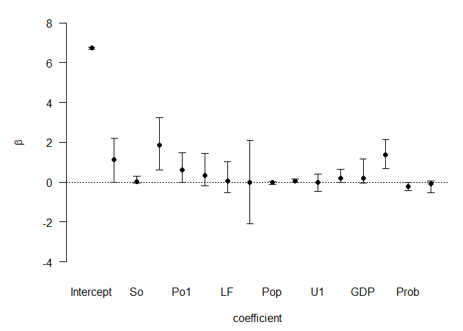

```r
### https://cran.r-project.org/web/packages/BAS/vignettes/BAS-vignette.html
  
library(BAS)

data(UScrime, package = "MASS")


UScrime[, -2] <- log(UScrime[, -2])


crime.ZS <- bas.lm(y ~ .,
                   data = UScrime,
                   prior = "ZS-null",
                   modelprior = uniform(), initprobs = "eplogp",
                   force.heredity = FALSE, pivot = TRUE)
```

`BAS` uses a model formula similar to `lm` to specify the full model
 with all of the potential predictors. Here we are using the 
 shorthand . to indicate that all remaining variables in the `data` 
 frame provided by the data argument. Different prior distributions 
 on the regression coefficients may be specified using the `prior` argument, 
 and include AIC, BIC, etc. "JZS" is the newest prior option. 
 It corresponds to the Zellner-Siow prior on the coefficients, but
 uses numerical integration rather than a Laplace approximation
 to obtain the marginal likelihood of models. 
 
 By default, `BAS` will try to enumerate all models if p<19 using the default
 `method="BAS"`. The prior distribution over the models is a `uniform()`
 distribution which assigns equal probabilities to all models. The last 
 optional argument `initprobs = eplogp` provides a way to initialize the 
 sampling algorithm and order the variables in the tree structure that 
 represents the model space in BAS. The eplogp option uses the Bayes factor 
 calibration of p-values `−eplog(p)` to provide an approximation to the marginal 
 inclusion probability that the coefficient of each predictor is zero, using 
 the p-values from the full model. Other options for initprobs include 
 “marg-eplogp”, “uniform”, and numeric vector of length p.
 The option “marg-eplogp” uses p-values from the p simple linear regressions 
 (useful for large p or highly correlated variables).
 Since we are enumerating under all possible models these options are not 
 important and the `method="deterministic"` may be faster if there are no factors 
 or interactions in the model.
 
### Plots
 Some graphical summaries of the out put ma be optained by the `plot` function.


```r
par(mfrow = c(2,2))
plot(crime.ZS, ask = F)
```

<!-- -->

Four plots produced. The first is a plot of residuals and fitted values under 
Bayesian Model Averaging. Ideally, if our model assumptions hold, we will not
see outliers or non-constant variance. The second plot shows the cumulative 
probability of the models in the order that they are sampled.This plot indicates
that the cumulative probability is leveling off as each additional model adds 
only a small increment to the cumulative probability, while earlier, there are 
larger jumps corresponding to discovering a new high probability model. The third 
plot shows the dimension of each model (the number of regression coefficients 
including the intercept) versus the log of the marginal likelihood of the model. 
The last plot shows the marginal posterior inclusion probabilities (pip) for 
each of the covariates, with marginal pips greater than 0.5 shown in red.  

The variables with pip > 0.5 correspond to what is known as the median probability 
model. Variables with high inclusion probabilities are generally important for 
explaining the data or prediction, but marginal inclusion probabilities may be 
small if there are predictors that are highly correlated, similar to how p-values 
may be large in the presence of multicollinearity. 


```r
crime.ZS
```

```
## 
## Call:
## bas.lm(formula = y ~ ., data = UScrime, prior = "ZS-null", modelprior = uniform(), 
##     initprobs = "eplogp", force.heredity = FALSE, pivot = TRUE)
## 
## 
##  Marginal Posterior Inclusion Probabilities: 
## Intercept          M         So         Ed        Po1        Po2         LF  
##    1.0000     0.8536     0.2737     0.9747     0.6652     0.4490     0.2022  
##       M.F        Pop         NW         U1         U2        GDP       Ineq  
##    0.2050     0.3696     0.6944     0.2526     0.6149     0.3601     0.9965  
##      Prob       Time  
##    0.8992     0.3718
```

```r
summary(crime.ZS)
```

```
##           P(B != 0 | Y)  model 1    model 2    model 3   model 4    model 5
## Intercept     1.0000000  1.00000  1.0000000  1.0000000  1.000000  1.0000000
## M             0.8535720  1.00000  1.0000000  1.0000000  1.000000  1.0000000
## So            0.2737083  0.00000  0.0000000  0.0000000  0.000000  0.0000000
## Ed            0.9746605  1.00000  1.0000000  1.0000000  1.000000  1.0000000
## Po1           0.6651553  1.00000  1.0000000  0.0000000  1.000000  1.0000000
## Po2           0.4490097  0.00000  0.0000000  1.0000000  0.000000  0.0000000
## LF            0.2022374  0.00000  0.0000000  0.0000000  0.000000  0.0000000
## M.F           0.2049659  0.00000  0.0000000  0.0000000  0.000000  0.0000000
## Pop           0.3696150  0.00000  0.0000000  0.0000000  1.000000  0.0000000
## NW            0.6944069  1.00000  1.0000000  1.0000000  1.000000  0.0000000
## U1            0.2525834  0.00000  0.0000000  0.0000000  0.000000  0.0000000
## U2            0.6149388  1.00000  1.0000000  1.0000000  1.000000  1.0000000
## GDP           0.3601179  0.00000  0.0000000  0.0000000  0.000000  0.0000000
## Ineq          0.9965359  1.00000  1.0000000  1.0000000  1.000000  1.0000000
## Prob          0.8991841  1.00000  1.0000000  1.0000000  1.000000  1.0000000
## Time          0.3717976  1.00000  0.0000000  0.0000000  0.000000  0.0000000
## BF                   NA  1.00000  0.9416178  0.6369712  0.594453  0.5301269
## PostProbs            NA  0.01820  0.0172000  0.0116000  0.010800  0.0097000
## R2                   NA  0.84200  0.8265000  0.8229000  0.837500  0.8046000
## dim                  NA  9.00000  8.0000000  8.0000000  9.000000  7.0000000
## logmarg              NA 23.65111 23.5909572 23.2000822 23.130999 23.0164741
```

A list of the top 5 models (in terms of posterior probability) with the 
zero-one indicators for variable inclusion. BF is the Bayes factor of
each model to the hights probability model. 

#' 
### Visualize the model space
See beyond the first five models


```r
par(mfrow = c(1,1))
image(crime.ZS, rotate = F)
```

<!-- -->

This plot indicates that the police expenditure in the two years do not 
enter the model together, and is an indication of the high correlation 
between the two variables.

### Examine the marginal distributions of two correlated coefficients 


```r
coef.ZS <- coef(crime.ZS)
par(mfrow = c(1,2))
plot(coef.ZS, subset = c(5:6), ask = F) ## take a look at Po1 v Po2
```

<!-- -->

The vertical bar represents the posterior probability that the coefficient 
is 0 while the bell shaped curve represents the density of plausible 
values from all the models where the coefficient is non-zero. This is 
scaled so that the height of the density for non-zero values is the 
probability that the coefficient is non-zero. Omitting the subset argument 
provides all of the marginal distributions.


```r
confint(coef.ZS)
```

```
##                   2.5%        97.5%        beta
## Intercept  6.666468238 6.7794394012  6.72493620
## M          0.000000000 2.1740073027  1.14359433
## So        -0.050877480 0.3083124591  0.03547522
## Ed         0.612553393 3.2126460831  1.85848834
## Po1       -0.002125501 1.4474725119  0.60067372
## Po2       -0.156638718 1.4532935669  0.31841766
## LF        -0.536891654 0.9836202512  0.05933737
## M.F       -2.072015708 2.1217489923 -0.02702786
## Pop       -0.126117443 0.0046579896 -0.02248283
## NW         0.000000000 0.1647453483  0.06668437
## U1        -0.519031286 0.3487275995 -0.02456854
## U2        -0.008004965 0.6580622098  0.20702927
## GDP       -0.004499620 1.1855201993  0.20625063
## Ineq       0.683094720 2.1168767994  1.39012647
## Prob      -0.408181062 0.0005588722 -0.21536203
## Time      -0.519296776 0.0406037961 -0.08433479
## attr(,"Probability")
## [1] 0.95
## attr(,"class")
## [1] "confint.bas"
```

the third column is the posterior mean.


```r
plot(confint(coef.ZS, parm = 2:16))
```

<!-- -->

```
## NULL
```

```r
plot(confint(coef(crime.ZS, estimator = "BMA"))) ## all models averaged
```

<!-- -->

```
## NULL
```

```r
plot(confint(coef(crime.ZS, estimator = "HPM"))) ## highest probability model
```

<!-- -->

```
## NULL
```

```r
plot(confint(coef(crime.ZS, estimator = "MPM"))) ## mean probability model
```

<!-- -->

```
## NULL
```

```r
# exclude variables with point masses at zero
```


---
title: "BAS-tutorial.R"
author: "eau6"
date: "2020-05-14"
---

